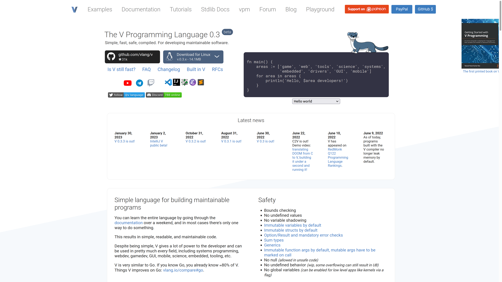

the idea here was to take https://github.com/hex2f/vlang.io (the original version) and update it to match the actual (live) version of the website the way it was (with all the nunjucks and npm).
i archieved it at the moment and pushed it here https://github.com/vlang/website/pull/242
but sadly, "because of proprietary backend" (statistics, translations) and the fact that the origin had a lot of "hot fixes" on top of some other version of the original, it had lots of conflicts so it wasnt merged

i later realised that the npm version is unnecessary and complex as the only JS that has to be used is to give a proper download link depending on user's OS so i tried to move everything to Hugo here https://github.com/t4wE/vlanghugo
for some time i updated that repository to match current state of the website but later gave up (started to feel pointless as it likely would never get mered).

-----------------------------------------------------------------------------------------------------------------------------
# The V Programming Language Website

https://vlang.io

\
[The original version](https://github.com/hex2f/vlang.io) was written by [leahlundqvist](https://github.com/hex2f) aka ``hex2f``.

*note: You can't run the whole site locally, because of proprietary backend, but you can preview the html file `index.html` for styling css.*

## How To Contribute

There are various way you can contribute to this project. Refactoring writings, updating css, adding language support etc. We will cover them one by one.

### Styling the website

There is `app.css` file in ``build`` folder  which is the main stylesheet. It is converted from `app.sass` file from the main repo and then minified. Use `index.html` in ``build`` folder to view the rendered html file. This will help you style the website.

### Adding Language

Use the `english.tr` in the ``translations`` folder as a reference to add your translation to this project.

### Building

The website is built via Nunjucks templates. By using ``npm run build`` the ``build-pages.js`` script creates pages from njk files (templates), converts sass to css, minifies it, and runs the page on ``localhost:3000`` via **serve**.

If you only want to build pages and not run them via ``serve`` then delete ``&& serve build/`` from line 23 of ``package.json``.

To build:
```
git clone https://github.com/vlang/website
cd website
npm install
npm install --global serve
npm run build
```
